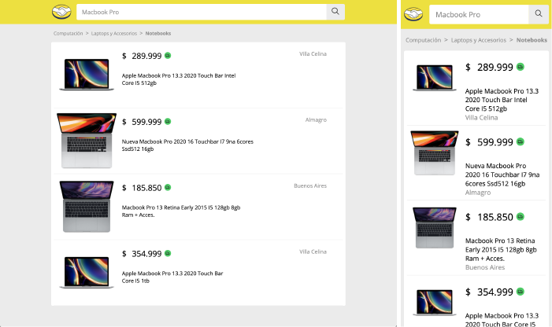
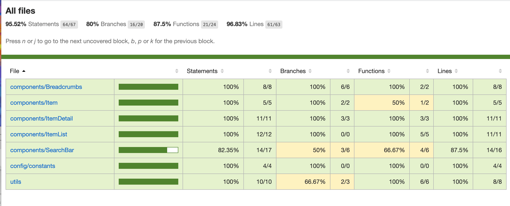

# Mercado Libre - Prueba tecnica

> Desarrollado por Jersson Morales | [LinkedIn](https://www.linkedin.com/in/jersson-stiven-morales-alza-022115183/)

### [URL demo](https://mercado-libre-frontend.vercel.app/)

#### Capturas de pantalla

#### Tecnologias usadas

- **React.js.**
- **Next.js** (SSR y SEO).
- **Sass** (Pre - procesador css).
- **Jest & React-testing-libray** (Pruebas unitarias).

#### Librerias adicionales

- **Currency.js** (Formateo de decimales).
- **React-responsive-carousel** (Componente de carousel). 
- **Prettier - eslint + plugins** (Validación de errores y formateo de archivos).
- **Husky - lint-stagged** (Validaciones de pruebas unitarias y linters previo a los commits).

#### Estructura  del proyecto

    frontend/
    |-- src/
    |   |-- __mocks__/  # Información de prueba para los componentes
    |   |
    |   |-- __test__/   # Pruebas unitarias
    |   |
    |   |-- components/ # Componentes generales
    |   |   |-- Componente/ # Carpeta del componente
    |   |   |   |-- index.js               # Componente
    |   |   |   |-- componente.module.scss # Archivo de estilos
    |   |-------
    |   |
    |   |-- config/     # Archivos de configuración y constantes
    |   |   |-- constants/ # Carpeta de constantes
    |   |   |-- |-- index.js # Archivo de constantes generales
    |   |-------
    |   |
    |   |-- pages/      # Paginas
    |   |
    |   |-- utils/      # Utilidades generales
    |-----

#### Scripts

-  **yarn dev** : Ejecuta el proyecto en modo desarollo.
-  **yarn build** : Compila el proyecto para enviarlo a producción
-  **yarn start** : Ejecuta el proyeto compilado.
-  **yarn lint** : Corre el linter en el proyecto.
-  **yarn test** : Ejecuta las pruebas unitarias.
-  **yarn test-with-coverage** : Ejecuta las pruebas unitarias y genera un reporte del cubrimiento
    de las pruebas.

#### Coverage

